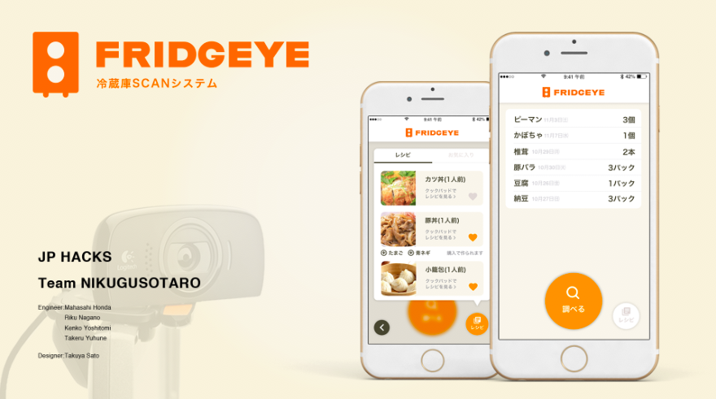

# FRIDGEYE

## 製品概要
### Life Tech

### 背景（製品開発のきっかけ、課題等）
- 身近なものをテクノロジーを使って，より便利にしたいと考えた
- 冷蔵庫を持つ人たちの「あれあったっけ？」や「今日の晩御飯は何にしよう？」といった，ちょっとした悩み事を解決する

### 製品説明（具体的な製品の説明）
IoTとスマートフォンアプリケーションを組み合わせて冷蔵庫の機能をアップデートする．具体的にはまず，冷蔵庫内の状態をカメラで撮影する．冷蔵庫には鏡を張っているため，狭い空間の中でも広い範囲を撮影できる．次に画像処理と機械学習を用いて，何が何個あるのかをサーバーを介してアプリに送る．ユーザーは冷蔵庫に入った食材の在庫をいつでも確認でき，買い物に役立てることができる．また，在庫の食材を元に献立のフィードバックを得れれる機能も実装しているため，在庫と献立を考えながら効率よく買い物できる．

### 特長

#### 1. 特長1
画像処理を用いて冷蔵庫内の在庫を検知，機械学習で判別
#### 2. 特長2
買い物中に冷蔵庫の中身を確認でき，買い物がしやすくなる
#### 3. 特長3
冷蔵庫の中にあるものを元に，献立のフィードバックがもらえる

### 解決出来ること
この製品を利用することによって最終的に解決できることについて記載をしてください。

### 今後の展望
食材の消費期限を管理．卵といった，カメラから見て冷蔵庫の死角に位置するものを圧力センサで管理

## 開発内容・開発技術
### 活用した技術
#### API・データ
* 楽天レシピカテゴリ一覧API
* 楽天レシピカテゴリ別ランキングAPI
* AWS
* Google Cloud Platform(Vision API)
* 翻訳API

#### フレームワーク・ライブラリ・モジュール
* React.js
* Redux
* superagent
* Material-UI
* Node.js
* Cordova
* Xcode

#### デバイス
* Raspberry Pi
* iPhone7
* Log9ool HDウェブカメラC510 

### 研究内容・事前開発プロダクト（任意）
* 特になし

### 独自開発技術（Hack Dayで開発したもの）
#### 2日間に開発した独自の機能・技術
* IoT化した冷蔵庫
* スマートフォンアプリ
* IoTとアプリを仲介するサーバー