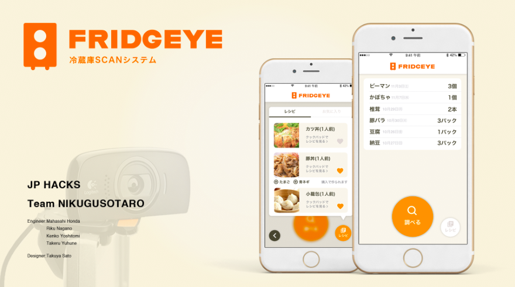

# サンプル（プロダクト名）

## 製品概要
### Life Tech

### 背景（製品開発のきっかけ、課題等）
- こんかいのプロダクトの開発に至った背景
- 着目した顧客・顧客の課題・現状

### 製品説明（具体的な製品の説明）
こちらに製品の概要・特徴について説明を記載してください。

### 特長

#### 1. 特長1
画像処理を用いて冷蔵庫内の在庫を検知，機械学習で判別
#### 2. 特長2
買い物中に冷蔵庫の中身を確認でき，買い物がしやすくなる
#### 3. 特長3
冷蔵庫の中にあるものを元に，献立のフィードバックがもらえる
### 解決出来ること
この製品を利用することによって最終的に解決できることについて記載をしてください。

### 今後の展望
食材の消費期限を管理．卵など，冷蔵庫の資格に配置するものを圧力センサで管理

## 開発内容・開発技術
### 活用した技術
#### API・データ
* 楽天レシピカテゴリ一覧API
* 楽天レシピカテゴリ別ランキングAPI
* AWS
* Google Cloud Platform(Vision API)
* 翻訳API

#### フレームワーク・ライブラリ・モジュール
* React.js
* superagent
* Redux
* Material-UI
* Node.js

#### デバイス
* Raspberry Pi
* iPhone7
* Log9ool HDウェブカメラC510 

### 研究内容・事前開発プロダクト（任意）
* 特になし

### 独自開発技術（Hack Dayで開発したもの）
#### 2日間に開発した独自の機能・技術
* 独自で開発したものの内容をこちらに記載してください
* 特に力を入れた部分をファイルリンク、またはcommit_idを記載してください（任意）
